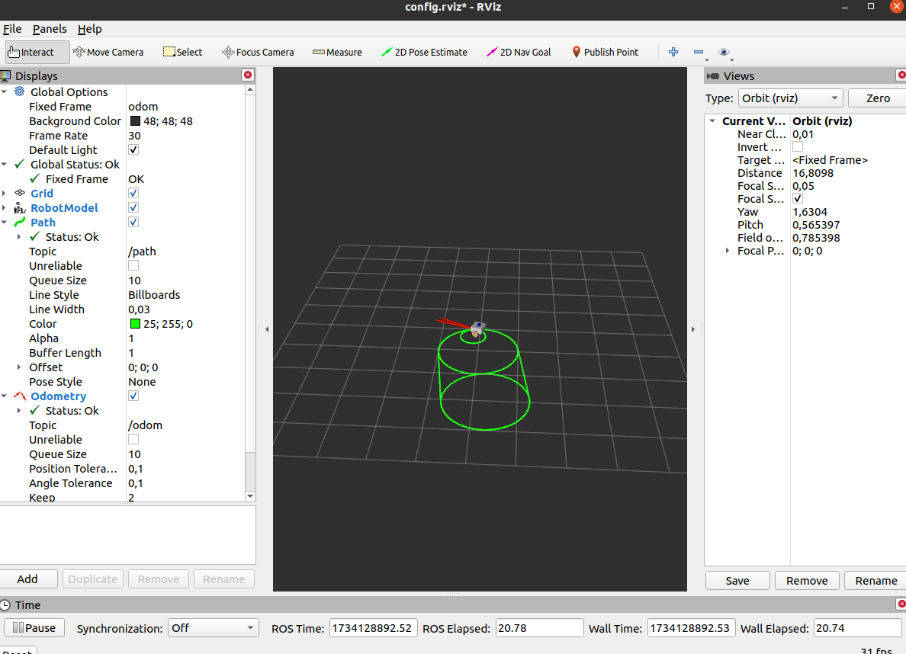

# Одометрия мобильного робота

## Цель работы
- Реализовать расчет одометрии мобильного робота с дифференциальным приводом.
- Обеспечить прохождение роботом заданной траектории.

## Что было сделано
1. Функция `forwardKinematics`:
2. Функция `updateOdometry`:

## Полученный результат
Робот успешно проходит заданную траекторию, видна корректная работа одометрии.



## Запуск проекта
1. Соберите пакет:

   ```bash
   cd ~/catkin_ws
   catkin_make
   source devel/setup.bash
   ```

2. Запустите симуляцию:
    ```bash
    roslaunch practice1 robot_kinematics.launch
    ```